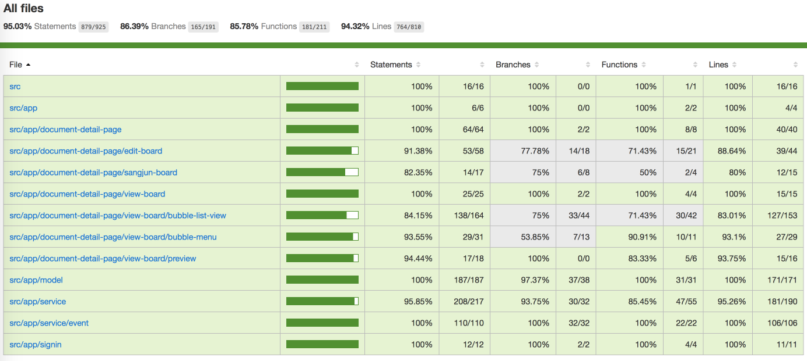
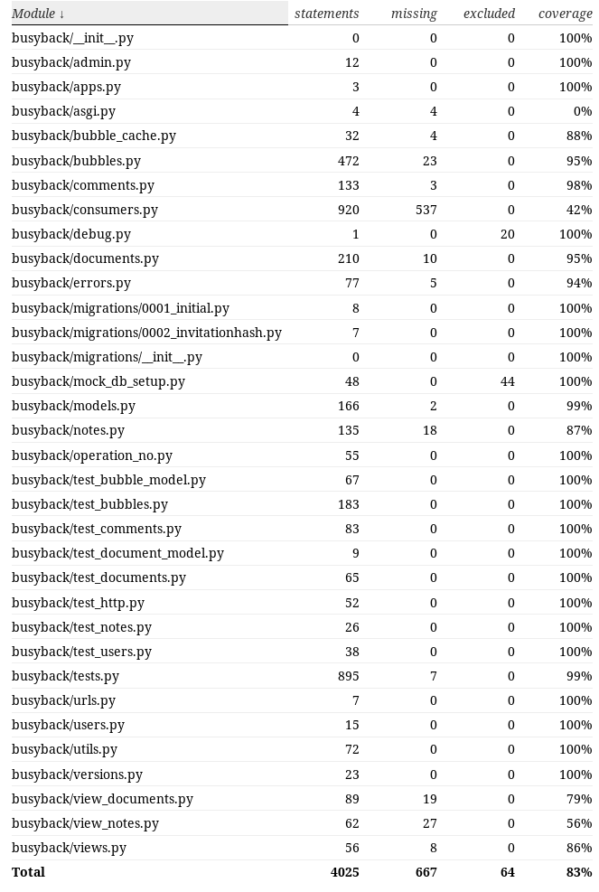

# BUSY WRITE

> writing is a form of discussion for busy teams

check progress results in 

[busywrite.ribosome.kr](busywrite.ribosome.kr)

# Progress
up until sprint3(2017.11.20)

## FrontEnd
- Implement html text editor + text rendering of View board
- Implement Preview of View board 
- Implement bubble menus of View board
- Implement Note tab of Edit board
- Implement Edit tab  of Edit board
- Implement Comment tab of Sangjun board
- Implement Suggest Bubble tab of Sangjun board
- Connect bubble menus of View board to lead to actions on Edit board & Sangjun board
- Implement logic of BubbleService and BoardService 
- Implement Signin page
- Implement test for all of the above

## BackEnd
- Implement models
- Implement views for Bubble, User and SignIn
- Implement channel consumers for connect, disconnect, get_bubble_list, create_bubble
- Implement test for models, views, channels

# Coverage
up until sprint3(2017.11.20)
## 
## 

